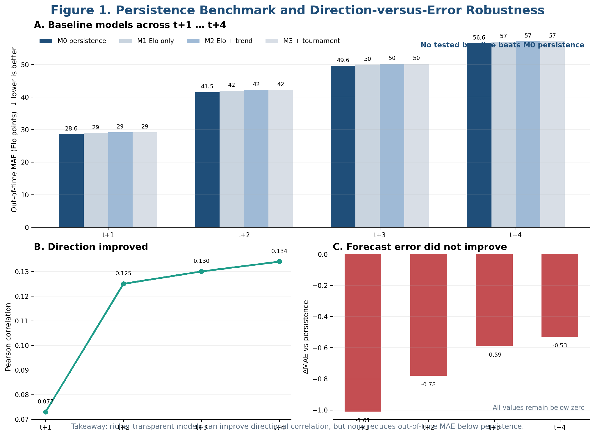
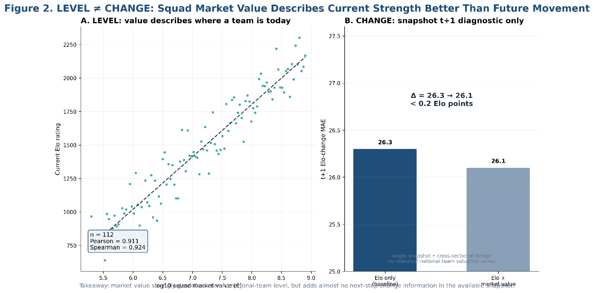

<p align="center">
  <b>The Persistence Ceiling</b><br>
  <b>Testing Whether Form, Tournaments, and Squad Value Improve National-Team Elo Forecasts</b><br><br>
  <i>MIT Sloan Sports Analytics Conference research project &middot; Soccer track &middot; Problem 11</i>
</p>

<p align="center">
  <b>Forecasting study.</b> All findings below are <b>predictive associations,
  not a causal effect</b>.
</p>

<p align="center">
  Future Elo is the forecasting outcome, not a claim of ground-truth football
  quality.
</p>

---

## The question

Federations routinely read recent form, tournament performance, volatility and
squad value as signs that a team is rising or fading. This repository does
**not** assume those signals say the same thing. It asks a narrower, checkable
forecasting question:

> **When current Elo is already known, does any richer historical signal carry
> additional out-of-time information about future national-team Elo?**

Predictive association is not a causal effect. A model that forecasts better is
not a policy recommendation, and nothing here says federations should do
anything differently. [What this does not show](#what-this-does-not-show) says
what the evidence cannot carry.

---

## The short answer

Within this evaluation, none of the tested signals beat persistence on accuracy
— and one of them clearly improved something else.

1. **Persistence is the benchmark, and nothing tested beat it.** Persistence MAE
   runs 28.62, 41.49, 49.62, 56.56 at t+1 through t+4. No tested feature family
   produced lower out-of-time MAE at any horizon.
2. **But directional signal did improve.** Trend-plus-volatility lifts
   directional correlation from 0.073 to 0.134 across horizons, while its MAE
   against persistence stays **negative** at every horizon, meaning worse.
3. **Squad value describes today's team far better than tomorrow's.** Across a
   112-team snapshot, log10 squad market value correlates with current Elo at
   Pearson 0.911 and Spearman 0.924. On the next-step change it adds almost
   nothing: Elo-plus-value MAE 26.14 against 26.28 for a fitted Elo-only model,
   with persistence at 26.09.

Read together: **knowing where a team is, which way it is moving, and whether a
forecast got more accurate are three different questions**, and the signals here
answer them differently.

---

## What is in this repository

| Path | Contents |
|---|---|
| [`paper/`](paper/README.md) | The approved conference paper, as a single PDF |
| [`results/`](results/README.md) | Five aggregate result tables |
| [`figures/`](figures/README.md) | The two figures used in the paper |
| [`documentation/methodology.md`](documentation/methodology.md) | Design, evaluation protocol, models, limitations |
| [`code/`](code/README.md) | Analytical and modelling code, and the package validator |
| [`data/README.md`](data/README.md) | What a full re-run needs, with input schemas |
| [`DATA_SOURCES.md`](DATA_SOURCES.md) | Every source, and why it is or is not redistributed |
| [`NOTICE.md`](NOTICE.md) | Source-by-source terms, attribution, image rights |
| [`PUBLIC_RELEASE_AUDIT.md`](PUBLIC_RELEASE_AUDIT.md) | What was included, what was excluded, and why |
| [`LICENSE`](LICENSE) | MIT, covering the code, figures, tables and paper only |

**No football data is distributed here.** That is a licensing decision. See
[`NOTICE.md`](NOTICE.md) and [`data/README.md`](data/README.md).

---

## The design in one table

| | Panel |
|---|---|
| Coverage | Rated men's national teams, **1980-2026** |
| Team-season rows | 10,566 |
| Evaluable rows at t+1 | 10,301 |
| Horizons | t+1 … t+4 |
| Evaluation | Expanding-window, rolling-origin, out-of-time pooling |
| Benchmark | Persistence, the current rating carried forward |
| Outcome | Future Elo change |

There is no random split anywhere, because a random split across calendar time
leaks the future into the past.

---

## What the numbers show

All figures are pooled **out-of-time** mean absolute error in Elo points, lower
is better. Every model is fitted only on strictly earlier data.

### Baselines

| Horizon | M0 persistence | M1 Elo only | M2 Elo+trend | M3 Elo+trend+tournament |
|---|---|---|---|---|
| t+1 | **28.62** | 29.17 | 29.45 | 29.52 |
| t+2 | **41.49** | 42.24 | 42.30 | 42.36 |
| t+3 | **49.62** | 50.46 | 50.27 | 50.31 |
| t+4 | **56.56** | 57.34 | 57.07 | 57.05 |

The bold column is the benchmark, and it is never beaten. Note how close M2 and
M3 get to it by t+4: the richer specifications close the gap without crossing
it. Tournament history adds essentially nothing to what rating trend already
carries.

### Read `n_total` before comparing two models

Feature availability changes how many rows each specification can be evaluated
on, so these models are **not** compared on an identical row set:

| Horizon | M0 | M1 | M2 | M3 |
|---|---|---|---|---|
| t+1 | 10,301 | 10,112 | 9,847 | 9,847 |
| t+2 | 10,038 | 9,849 | 9,587 | 9,587 |
| t+3 | 9,776 | 9,589 | 9,329 | 9,329 |
| t+4 | 9,517 | 9,331 | 9,072 | 9,072 |

A raw MAE difference between two different `n_total` values is **not** a paired
effect and is not read as one here.

### Direction versus error

This is the check that constrains the claims most. Model R3, trend plus
volatility:

| Horizon | t+1 | t+2 | t+3 | t+4 |
|---|---|---|---|---|
| Pearson | 0.073 | 0.125 | 0.130 | 0.134 |
| MAE change vs persistence | −1.01 | −0.78 | −0.59 | −0.53 |

Directional correlation improves monotonically. Accuracy gets *worse* at every
horizon. Additional information about **direction** did not become a more
accurate forecast of the future **level**.



*Figure 1. Persistence benchmark and direction-versus-error robustness: richer
models can improve directional correlation while still failing to beat
persistence on out-of-time MAE.*

### Squad value describes level, not change

| Question | Statistic |
|---|---|
| Snapshot size | 112 teams |
| log10 market value vs current Elo, Pearson | 0.911 |
| log10 market value vs current Elo, Spearman | 0.924 |
| Raw-EUR market value vs current Elo, Pearson | 0.657 |
| Next-step MAE, persistence | 26.09 |
| Next-step MAE, fitted Elo-only | 26.28 |
| Next-step MAE, Elo + log10 value | 26.14 |

The value↔Elo relationship at the **level** is about as tight as a
cross-sectional relationship gets. At the **change** it is worth 0.14 MAE
against a fitted Elo-only model, and it does not reach persistence.



*Figure 2. LEVEL != CHANGE: squad market value strongly describes current
strength, but adds almost no next-step change information in the available
snapshot.*

This exercise is an **in-sample snapshot diagnostic**, not a historical
rolling-origin out-of-time test, and it is labelled that way everywhere it
appears. No historical national-team market-value series was available to test
it properly.

---

## What this does not show

- **Not causal.** Observational data and a forecasting design. Nothing here
  shows that raising squad value, or entering more tournaments, raises Elo.
- **Not a universal ceiling.** "No tested model beat persistence" is a statement
  about this specification set, this target and these horizons. It is not a
  proof that no richer signal could ever help.
- **Persistence is partly expected by construction.** Elo updates in response
  to match-result surprises, so carrying it forward is a naturally demanding
  benchmark when future Elo is the target. Beating it is forecasting hygiene,
  not the contribution. The contribution is the **level / direction / error**
  separation.
- **Not a quality index.** Elo compresses match results. It is not a complete
  measure of national-team strength, and this study does not treat it as one.
- **Not a Germany finding.** Germany appears once, as an illustrative
  single-country slice in the robustness tables. No claim rests on it.
- **Not validated on other sources.** The rating series has no independent
  cross-check. football-data.co.uk was unreachable from the research
  environment and was not bypassed. No FBref or StatsBomb data is used, and no
  coverage of either is claimed.
- **Not a paired comparison.** Models are evaluated on different row counts.
  See `n_total` above.

---

## Reproducibility: PARTIAL

**Public:** the analytical code, the aggregate results, the paper figures, and
[`code/validate_public_package.py`](code/validate_public_package.py), which
re-checks every published headline number against the published tables and runs
the layout, link, portability and restricted-content scans.

**Conditional:** rebuilding the inputs from lawful local copies of the sources,
then re-running the pipeline under [`code/`](code/README.md).

**Not provided:** the raw data and the row-level derived tables. See
[`data/README.md`](data/README.md).

Aggregate verification is not retraining. The validator confirms the published
numbers are internally consistent and match the frozen values. It does not
re-estimate a single model.

## Validation

```
python -m pip install -r requirements.txt
python code/validate_public_package.py
```

The validator uses only the standard library, so it runs without installing
anything.

---

## Attribution

- Elo ratings: **eloratings.net**, by Kirill Bullygin.
- Games, national teams and squad valuations: the **transfermarkt-datasets**
  dataset by David Caribou, a published CC0 mirror of data originating from
  transfermarkt.com. This project uses the published dataset and does not
  scrape transfermarkt.com.

Neither source's data is redistributed here. Full terms, including why each
source is not published, are in [`NOTICE.md`](NOTICE.md) and
[`DATA_SOURCES.md`](DATA_SOURCES.md).

## Author

**Rupayan Halder**

**Authorship: CONFIRMED.** Rupayan Halder is the sole author of this research
release. No other person may be added as an author. Reviewer comments, project
files, acknowledgements, related projects, previous papers and the SoccerSolver
collaboration were all explicitly excluded as sources of authorship, and
commenting on the abstract as a reviewer does not establish it. See
[`CITATION.cff`](CITATION.cff).

**Research collaboration:**

> This research was developed in collaboration with SoccerSolver. SoccerSolver
> currently works with more than 10 football clubs.

SoccerSolver is a research collaborator and acknowledgement, and is **not** an
author. It is not a funder, sponsor or owner of this research either, none of
which is claimed. Its inclusion implies no endorsement, and none of its data is
used in any result published here.

---

## Publication status of this repository

| Question | Answer |
|---|---|
| Authorship | **CONFIRMED** — Rupayan Halder |
| Paper | **Published** — the approved PDF is in `paper/` |
| Restricted-material scan | **Clear** |
| Package complete and validating | **Yes** |
| GitHub content ready | **YES** |
| Safe to push | **YES**, after the two paper placeholders are noted below |

### Two open items on the paper, not on the repository

The approved PDF retains two placeholders, deliberately left as they are because
filling them in would mean editing the approved artifact or inventing an
identifier:

1. `Soccer Paper ID: [To be assigned]`
2. `Open-source repository: [PUBLIC ANONYMIZED GITHUB URL REQUIRED BEFORE SUBMISSION]`

Both are documented in [`paper/README.md`](paper/README.md) and must be resolved
in the submission copy. Neither affects any result published here.

## Licence

Project-controlled material — code, figures, aggregate tables, paper and
documentation: [MIT](LICENSE). Underlying football data: not distributed, see
[`NOTICE.md`](NOTICE.md).
